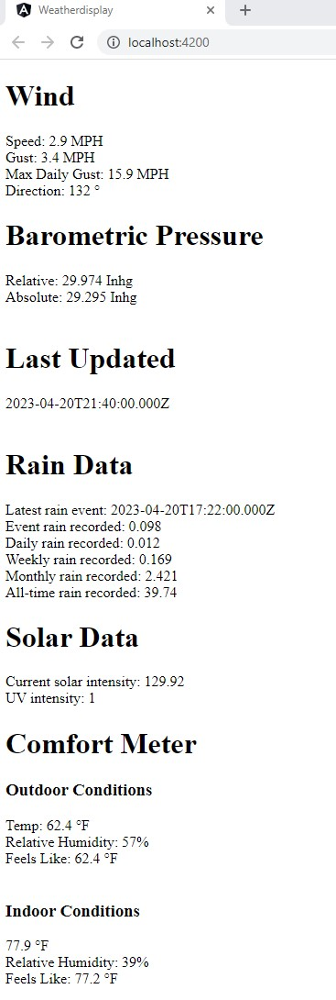

# Weather Display

Weather Display uses the [Ambient Weather](https://ambientweather.com/) RESTful [API](https://ambientweather.com/faqs/question/view/id/1811/) to retrieve data generated by their line of personal weather stations.  Mine is a [WS-2902C](https://ambientweather.com/ws-2902-smart-weather-station)

## The Story

After my layoff from SkyKick, one of my main disappointments was not having the opportunity to continue learning Angular 14 and NGRX.  It's a fascinating front end technology and it is worth knowing if you want to be a full stack developer.  Although I am by no means an Angular expert after doing this project, I've moved the needle significantly by accomplishing what you see here.

My personal Ambient weather station is installed outside my home in Sterling Heights, Michigan.  As far as I can tell, it is reasonably accurate with the sole exception of the speed of winds that are coming in from the south; as it turns out there is no good location on my property that isn't at least partially blocked from that direction.

I hate to admit how much time I've spent on this.  The basic set-up of calling the API, coding the components and building the NGRX artifacts were trivial.  The problem I faced was a naming issue that caused all of the selectors to seemingly inexplicitly not work.  The actual problem was extremely minor in the end, but it took a couple of weeks of research and experimentation to resolve.  Alas, not being able to ask anyone for help is one of the problems endemic to working on solo projects.

As an experienced software developer, however, I am used to solving problems, and although this one was a bit frustrating, I still enjoyed the process.  My research included using [ChatGPT](https://chat.openai.com/), [StackOverflow](https://stackoverflow.com/), and the [official NGRX documentation](https://ngrx.io/).  I can bring this patience and expertise to your team.  See the below for my contact information.

## Technology

This application was developed using Angular 14, NGRX and TypeScript to develop a Single Page App (SPA) with centrally-managed state.  

At the moment, the data display is plain HTML; it's more of an Angular/NGRX showcase than it is a work of art.

It will slowly develop into a more fully featured (and prettier) application as I have time.  

## API Keys
In order to use this application, you will need an application API Key and a personal API key in order to access their servers.  

These keys are deliberately kept off of this Git repository as there is enough of my personal data floating around on the web unsupervised <ahem, Facebook>, but I can supply them to you so you can see the output of my personal weather station if need be.  The keys are stored in a file called src/assets/.env in the following format:

    # Environment variables

    # Application API Key
    applicationKey=xxx

    # API Key for weather station (Device Key)
    apiKey=xxx
  
If you wish to register your own keys, this can be done at the Ambient Weather Website: https://ambientweather.net/account

## Getting Started

* You need NodeJS version 18.15.0 or higher, and NPM version 9.5.0.  I recommend using NVM to get just the right versions.

* Clone the repository:
  
        git clone https://github.com/ggariepy/weatherdisplay.git
  
* Perform an NPM Install

        npm install

* Create a src/assets/.env file and add in your API keys

* Run the application

        npm run start

## About the Author

My name is Geoff Gariepy, and I am a full stack software developer who is always interested in new technologies and new opportunities.

Find me on LinkedIn at [https://www.linkedin.com/in/geoff-gariepy/](https://www.linkedin.com/in/geoff-gariepy/).

You can email me at [geoff.gariepy@gmail.com](mailto:geoff.gariepy@gmail.com).